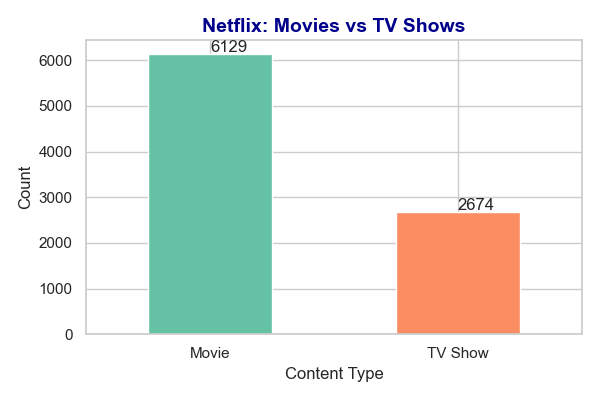
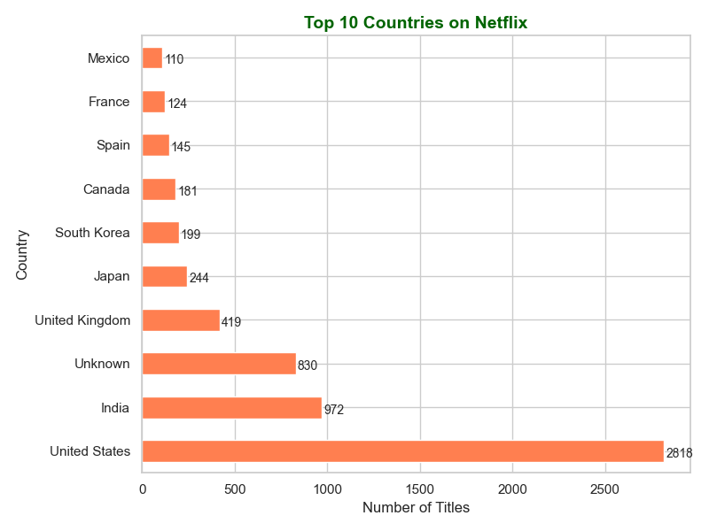
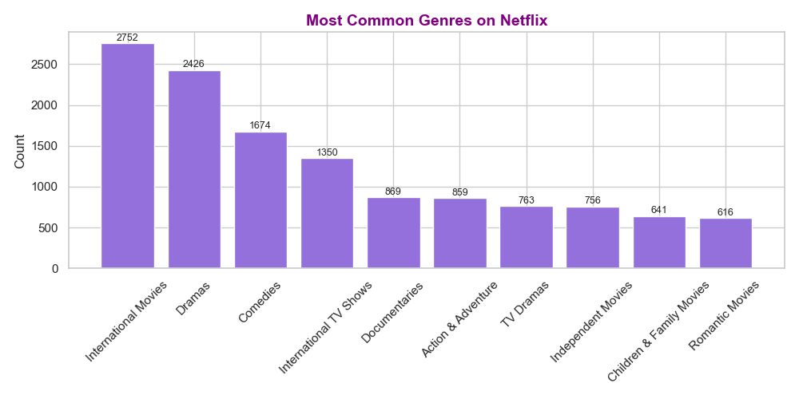
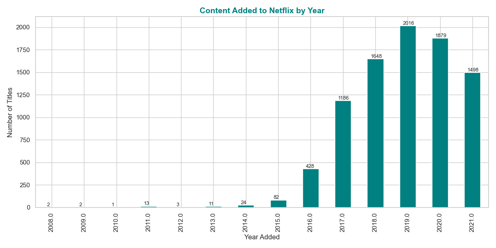

# 📊 Netflix EDA Project – CodeAlpha Internship Task 2

This repository contains my submission for **Task 2: Exploratory Data Analysis (EDA)** as part of the **CodeAlpha Data Analytics Virtual Internship**.

---

## 📁 Dataset

- Source: [Netflix Titles Dataset – Kaggle](https://www.kaggle.com/datasets/shivamb/netflix-shows)
- Description: 8807 rows of Netflix content data (movies and TV shows) with attributes like title, country, director, genre, release year, and date added.

---

## 🛠 Tools & Libraries Used

- Python
- Pandas
- Matplotlib
- Seaborn
- Collections (Counter)

---

## 📌 Project Objectives

✔ Ask meaningful questions before analysis  
✔ Explore data structure, types, and shape  
✔ Identify trends, patterns, and anomalies  
✔ Use visualizations to test assumptions  
✔ Handle missing values and prepare clean data  

---

## 📈 Visual Analysis & Insights

### 🔹 1. Type Distribution (Movies vs TV Shows)
  
**Insight:** Netflix has significantly more movies than TV shows.

---

### 🔹 2. Top 10 Countries by Content
  
**Insight:** The USA and India lead in producing content available on Netflix.

---

### 🔹 3. Most Common Genres
  
**Insight:** Dramas, International content, and Comedies are the most represented genres.

---

### 🔹 4. Content Added Per Year
  
**Insight:** Most content was added between 2017 and 2020, with a notable spike around 2019.

---

## 🧠 Summary of Key Insights

- Netflix has a dominant share of movies over TV shows.
- USA and India are the top contributing countries.
- Dramas and Comedies are the most frequent genres.
- Content uploads peaked between 2018–2020.
- Several entries had missing directors or country info, which were cleaned accordingly.

---

## 🏁 Internship Details

**Internship Name:** Data Analytics Internship  
**Organization:** [CodeAlpha](https://www.codealpha.tech/)  
**Task:** Exploratory Data Analysis (Task 2 of 4)  
**Status:** ✅ Completed and Submitted

---

## 📬 Connect With Me

- 🔗 [LinkedIn](https://www.linkedin.com/in/sushant-chaudhary-aa062a231)
- 💻 [GitHub Profile](https://github.com/sush8471)
